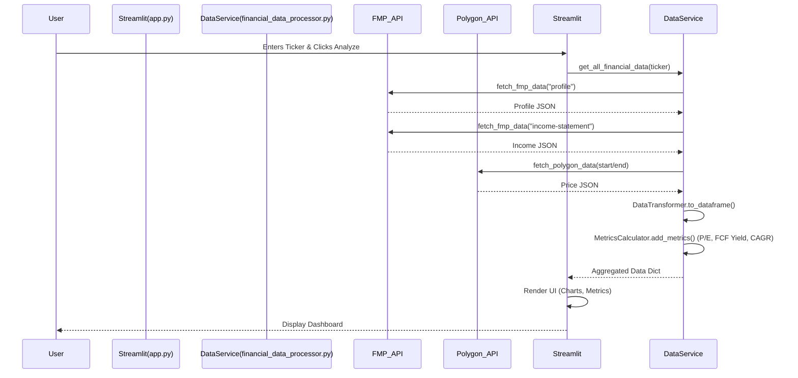

# 📊 Stock Analysis Dashboard Architecture

## System Overview: A Layered Design

The application follows a **layered, service-oriented architecture** with clear separation of concerns, primarily structured around **data processing** and **presentation**.

| Layer | Responsibility | Components |
| :--- | :--- | :--- |
| **Presentation** | User Interface (Streamlit), Layout, Charting, Metrics Display. | `app.py` (`DashboardApp`, `ChartRenderer`, `MetricsDisplay`) |
| **Service/Logic** | Orchestration of data flow, business logic, metric calculations. | `financial_data_processor.py` (`FinancialDataService`, `MetricsCalculator`) |
| **Data Access** | Fetching and transforming raw data from external APIs. | `financial_data_processor.py` (`APIClient`, `DataTransformer`) |

---

## 💻 Component View: `app.py` (Presentation & Orchestration)

This file acts as the **Controller** and **View** for the Streamlit application.

### Key Components

| Class/Component | Role | Dependencies |
| :--- | :--- | :--- |
| **`DashboardApp`** | **Main Controller/Orchestrator.** Manages the application lifecycle (`run`), state (`st.session_state`), and delegates rendering/data fetching. | `APIClient`, `FinancialDataService`, `ChartRenderer`, `MetricsDisplay` |
| **`ChartRenderer`** | **View Utility.** Encapsulates all chart generation logic using `plotly.graph_objects` and `plotly.express`. | `plotly`, `pandas` |
| **`MetricsDisplay`** | **View Utility.** Handles rendering of all KPI cards and metrics using `st.metric`. | `streamlit` |
| **Streamlit (`st`)** | **The View.** Provides the web-based UI framework, handles user input (sidebar ticker), and displays outputs. | N/A |

### Data Flow within `app.py`

1. **`DashboardApp.run()`** calls `render_sidebar()` to get the `ticker`.
2. It calls **`FinancialDataService.get_all_financial_data(ticker)`** to fetch all data.
3. It calls **`MetricsDisplay.display_overview()`** for high-level KPIs.
4. It calls section-specific render methods (e.g., `render_price_section`), which in turn call:
    * `ChartRenderer` to create plot figures.
    * `MetricsDisplay` to show associated metrics (like CAGRs).

---

## ⚙️ Component View: `financial_data_processor.py` (Service & Data)

This file contains the **Core Business Logic**, Data Access, and Transformation logic.

### Key Components

| Class/Component | Role | Responsibilities |
| :--- | :--- | :--- |
| **`FinancialDataService`** | **Service Layer/Gateway.** Orchestrates API calls, transformation, and metric enrichment. | Fetches all data endpoints, coordinates enrichment. |
| **`APIClient`** | **External API Access.** Handles HTTP requests to **FMP** and **Polygon**. Encapsulates API keys and base URLs. | Error handling (`raise_for_status`). |
| **`DataTransformer`** | **Data Preparation.** Converts raw JSON responses into clean, sorted `pandas.DataFrame` objects. | Date formatting, data alignment, price data resampling (`resample_to_monthly`). |
| **`MetricsCalculator`** | **Business Logic.** Calculates derived financial metrics and ratios. | **CAGR**, **P/E Ratio**, **Profit Margins**, **FCF - SBC**, **FCF Yield**. |

---

## 🔗 Interface and Data Flow Diagram

The system operates as a **Request-Response** cycle initiated by the Streamlit application.

---

# 🛡️ Architecture Highlights & Decisions

## 1. Separation of Concerns (SoC)
Clear Boundaries: The logic is strictly divided:

Data Fetching: Handled by APIClient.

Data Structuring/Cleaning: Handled by DataTransformer.

Business Calculations: Handled by MetricsCalculator.

Orchestration & UI: Handled by FinancialDataService (backend) and DashboardApp (frontend).

Benefit: Allows for easy swapping of data sources (e.g., replacing FMP with a different provider requires only modifying APIClient).

---

## 2. State Management
Ephemeral State: Streamlit's st.session_state is used to persist the selected ticker across reruns, ensuring a responsive user experience.

Configuration: External API keys are loaded via .env and dotenv, improving security and environment management.

---

## 3. Data Processing Pipeline
Data-First Approach: Financial data is fetched, transformed, and then enriched before being passed to the presentation layer.

Enrichment Chain: FinancialDataService.enrich_financial_data ensures that core metrics like P/E Ratio and FCF Yield are calculated and added to the DataFrame only once, simplifying rendering logic.

---

## 4. Code Reusability
Generic Charting: ChartRenderer provides reusable render_line_chart and render_bar_chart methods, abstracting Plotly implementation details from the main application logic.

Generic CAGR: MetricsCalculator.calculate_metric_cagrs is a generalized method for calculating growth rates on any financial column (Revenue, EPS, FCF, etc.).

---